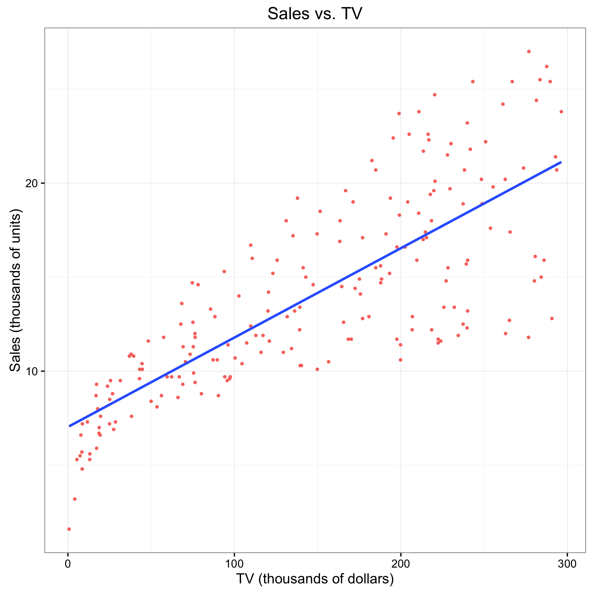

## Abstract
In section 3.1 - *Simple Linear Regression* of the book **An Introduction to Statistical Learning**, we used the data set taken from advertising and performed simple linear regression of Sales on TV. In this report we will reproduce the graphs, regression, and analysis in a reproducible manner.  

## Introduction
The purpose of advertising for a certain good is to hopefully increase its sales. With the technologies available today, there are many possible channels for advertisements to reach their audience. In this report, we will focus on the relationship between the budget alloted for TV advertisement and Sales and see if we can determine whether there is a relationship between the two variables. 

## Data 
The advertising data used in the book consists of **Sales** (in thousands of units) of a particular prouduct in 200 different markets and advertising budgets (in thousands of dollars) for the product in each of those markets. In particular, the advertising budgets were for **TV**, **Radio**, and **Newspaper**. 

## Methodology
In this paper, we will be focusing in particular on the relationship between the Sales (in thousands of units) and TV budget (in thousands of dollars). In particular, our model for the simple linear regression will be: 

 *Sales*  = $\beta_0$ + $\beta_1$ * *TV*


 To esimate the coefficients for $\beta_0$ and $\beta_1$, we will use the ordinary least squares regression in R. 

## Results

Using OLS, we get the estimates of the coefficients as shown in Table 1.

```{r results= 'asis', echo =FALSE}
load("../data/regression.RData")
library(xtable)
tb1 <- xtable(regression, caption = 'Information about Regression Coefficients')
print(tb1, comment= FALSE)
```

Regarding the regression quality and the fitness of our regression, we reference the following table (Table 2). 

```{r results= 'asis', echo =FALSE}

sumtb <- data.frame(c("Residual standard error", "R Squared", "F-Statistics") ,c(reg_summary$sigma, reg_summary$r.squared, reg_summary$fstatistic[1]))

colnames(sumtb) <- c("Quantity", "Value")

tb2 <- xtable(sumtb, digits = 2, caption = 'Regression Quality Indicies')

print(tb2, comment =FALSE, include.rownames=FALSE)

```

The scatterplot of Sales on TV with the regression lines fitted is shown below:


## Conclusions